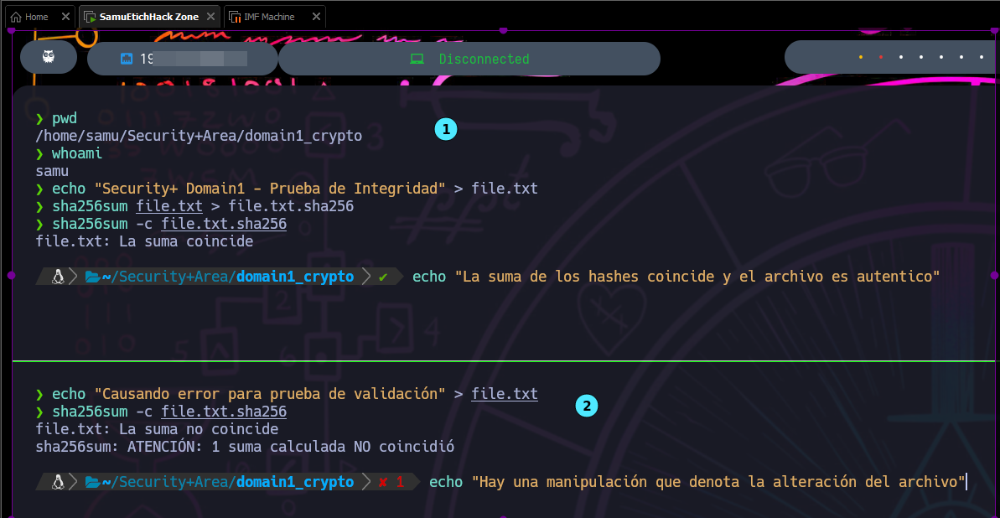

# Mini Lab: Generación y Verificación de Hash SHA-256

El objetivo de este ejercicio es generar un hash SHA-256 a partir de un archivo y verificar su integridad comparándolo con un hash conocido. Este mini-lab
demuestra comprensión del concepto de hashing, una habilidad requerida en el examen Security+.

**Nota rápida:** SHA-256 es una función criptográfica de hashing que toma una entrada y produce un valor único de 256 bits. Se utiliza para comprobar integridad, ya que incluso
un cambio mínimo en el archivo modifica completamente el hash generado.

## Resultado de la verificación de integridad (ejemplo desde mi consola en ParrotOS)

En la consola se ejecutó `sha256sum -c file.txt.sha256` y se obtuvo:

